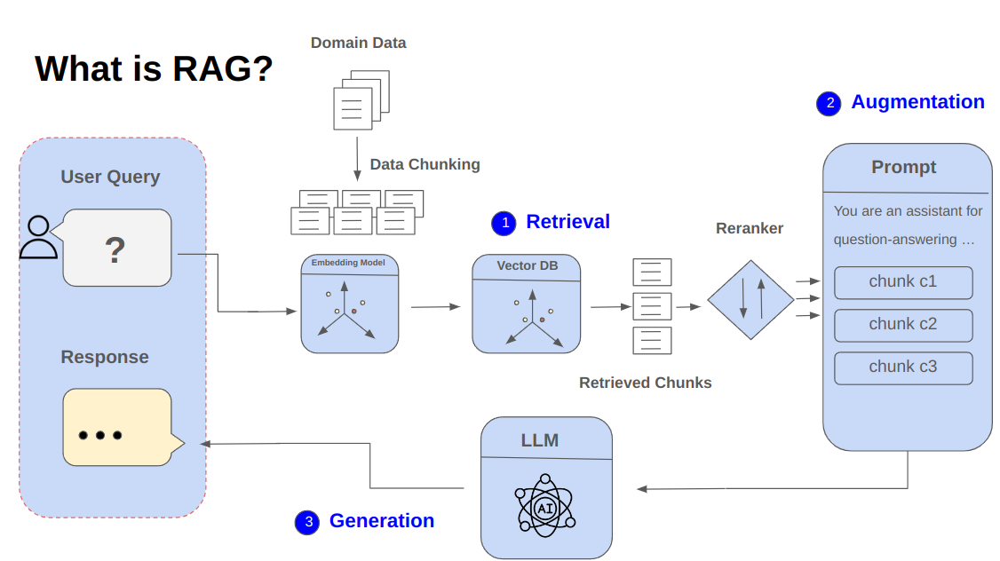

# RAGondin 

RAGondin is a project dedicated to experimenting with advanced RAG (Retrieval-Augmented Generation) techniques to improve the quality of such systems. We start with a vanilla implementation and build up to more advanced techniques to address challenges and edge cases in RAG applications.  



## Goals
- Experiment with advanced RAG techniques
- Develop evaluation metrics for RAG applications
- Collaborate with the community to innovate and push the boundaries of RAG applications

## Current Features
This section provides a detailed explanation of the currently supported features. 
The **`.hydra_config`** directory contains all the configuration files for the application. 
These configurations are structured using the [Hydra configuration framework](https://hydra.cc/docs/intro/). 
This directory will be referenced for setting up the RAG (Retrieval-Augmented Generation) pipeline.

- **Supported File Formats**  
The current branch supports the following file formats: `pdf`, `docx`, `doc`, `pptx`, `ppt`, and `txt`. Future updates will expand support to include formats such as `odt`, `csv`, audio and video files, and `html`.  

For all supported file types, the content is converted into Markdown, with images replaced by captions generated using a Vision Language Model (VLM). (Refer to the **Configuration** section for more details.) The resulting Markdown is then chunked and indexed in the [Milvus vector database](https://milvus.io/).

- **Chunking**  
Different chunking strategies are available, including **`semantic`** and **`recursive`** chunking. By default, the **recursive chunker** is used for processing all supported file types due to its efficiency and low memory consumption. This is the **recommended chunker** for most use cases. Future updates may introduce format-specific chunkers, such as specialized chunkers for CSV, Markdown, and other formats. Details about the recursive chunker can be found in the configuration file: *`.hydra_config/chunker/recursive_splitter.yaml`*.

```yml
# .hydra_config/chunker/recursive_splitter.yaml
defaults:
  - base
name: recursive_splitter
chunk_size: 1500
chunk_overlap: 300
```
Here, the **`chunk_size`** and **`chunk_overlap`** are measured in tokens rather than characters. For improved retrieval performance, you can enable the contextual retrieval feature. This technique, known as "Contextual Retrieval," was introduced by Anthropic to enhance retrieval quality (see [Contextual Retrieval](https://www.anthropic.com/news/contextual-retrieval) for more details). To activate this feature, set **`CONTEXT_RETRIEVAL=true`** in your **`.env`** file. Refer to the **`Usage`** section for additional instructions.

- **Indexing & Search**  
After chunking, the data is indexed in the **Milvus** vector database using the multilingual embedding model `HIT-TMG/KaLM-embedding-multilingual-mini-v1`, which performs well on the [MTEB benchmark](https://huggingface.co/spaces/mteb/leaderboard). Developers can customize the embedding model by setting the **`EMBEDDER_MODEL`** variable in the *`.env`* file to any compatible model from Huggingface, such as `"sentence-transformers/all-MiniLM-L6-v2"` for faster processing.

**Note**: When selecting an embedding model, consider the language of your documents and the model's context length (token limit). The default model supports both French and English. The same model is also used to embed user queries for semantic (dense) search.

  * **Hybrid Search**: Combines **`semantic search`** with keyword search (using **`BM25`**) to handle domain-specific jargon and coded product names that might not exist in the embedding model's training data. By default, our search pipeline  uses hybrid search.

- **Retriever**  
  Supports three retrieval modes: **`multiQuery`**, **`single`**, and **`HyDE`**:
  - **multiQuery**: Leverages an LLM to generate multiple query variations, combining the results from each query for improved relevance. This is the default and most effective mode based on our tests.
  - **single**: Performs standard document retrieval using a single query.
  - **HyDE**: Utilizes an LLM to generate a hypothetical answer, then retrieves documents that align with (in term of similarity) this generated response.

- **Grader**: Filters out irrelevant documents after retrieval using an llm. Currently it's set to be **`false`**.
- **Reranker**: Uses a multilingual reranking model to reorder documents by relevance with respect to the user's query. By default, we use the **`jinaai/jina-colbert-v2`**. For experimentation, set the **`RERANKER_MODEL`** in the **`.env`** file. 

**`Note`**: This part is important because the retriever returns documents that are semantically similar to the query. However, similarity is not synonymous with relevance, so rerankers are essential for reordering documents and filtering out less relevant ones. This helps reduce hallucination by weeding out irrelevant ones.

- **RAG Types**:  
    * **SimpleRAG**: Basic implementation without chat history  
    * **ChatBotRAG**: Version that maintains conversation context. 

## Configurations

## Usage

### 1. Clone the repository:
```bash
git clone https://github.com/OpenLLM-France/RAGondin.git
cd RAGondin
git checkout main # or dev if you want to try the dev branch
```

#### Environment Setup

First, the users are suggested to run RAGondin in a virtual environment (for all the necessary libraries and packages). It can be done easily with:

```bash
python -m venv .venv
source .venv/bin/activate
```

### 2. Create uv environment and install dependencies:
**Requirements**: Ensure you have Python 3.12 installed along with `uv`. For detailed installation instructions, refer to the [uv official documentation](https://docs.astral.sh/uv/getting-started/installation/#pypi).

* To install `uv`, you can use either `pip` (if already available) or `curl`. Additional installation methods are outlined in the [documentation](https://docs.astral.sh/uv/getting-started/installation/#pypi).
```bash
# with pip
pip install uv

# with curl
curl -LsSf https://astral.sh/uv/install.sh | sh
```

```bash
# Create a new environment with all dependencies
uv sync
```

### 3. Create a .env file

Add a `.env` file at the root of the project to configure the LLM (Language Model) and VLM (Vision Language Model) settings. 

It is mandatory to configure the LLM settings (`API_KEY`, `BASE_URL`, `MODEL_NAME`) as well as the VLM settings (`API_KEY`, `BASE_URL`, `MODEL_NAME`). The **`VLM`** is specifically utilized for generating captions for images extracted from files during the vectorization process. If you plan to use the same model for both LLM and VLM functionalities, you can reuse the same settings for both.

For PDF file indexing, multiple options are available:
- **`MarkerLoader` and `DoclingLoader`** are recommended for the best performance (requires GPU).
- **PyMuPDF4LLMLoader** or **PyMuPDFLoader**: Suggested for non-GPU users. Not that these loader doesn't handle Non-searchable PDF nor does it handle images (**`We will add it`**).

Concerning the audio and video files, we use OpenAI's Whisper model to convert the audio into plain text. The file extensions supported by RAGondin are: .wav, .mp3, .mp4, .ogg, .flv, .wma, .aac. You can also choose the model used for transcription for speed or precision. Here are all the Whisper's models: tiny, base, small, medium, large, turbo. For more information, checkout [OpenAI Whisper](https://github.com/openai/whisper)

Other file formats are pre-configured with optimal settings.

```bash
# LLM settings
BASE_URL=
API_KEY=
MODEL=

# VLM settings
VLM_BASE_URL=
VLM_API_KEY=
VLM_MODEL=

# App
APP_PORT=8083
APP_HOST=0.0.0.0

# To enable HTTP authentication via HTTPBearer
AUTH_TOKEN=super-secret-token

## More settings can be added (see .env.example)

# Loaders
PDFLoader=DoclingLoader

# Audio
WHISPER_MODEL=base
```

### 4.Deployment: Launch the app

Make sure that you have Docker Desktop in disposition. If not, check out the installation in the official website [Docker](!https://www.docker.com/).

The application can be launched in either a GPU or CPU environment, depending on your device's capabilities. Use the following commands:

```bash
# Launch with GPU support (recommended for faster processing)
docker compose up --build

# Launch with CPU only (useful if GPU is unavailable)
docker compose --profile cpu up --build
```

Once it is running, you can check everything is fine by doing:
```bash
curl http://localhost:8083/health_check
```

> **Note**: The initial launch is longer due to the installation of required dependencies. Once the application is up and running, you can access the api documentation at `http://localhost:8083/docs` (8083 is the APP_PORT variable determined in your **`.env`**) to manage documents, execute searches, or interact with the RAG pipeline (see the **next section** about the api for more details). A default chat ui is also deployed using [chainlit](!https://docs.chainlit.io/get-started/overview). You can access to it at `http://localhost:8083/chainlit` chat with your documents with our RAG engine behind it.


* **Running on CPU**:  
  For quick testing on a CPU, you can optimize performance by reducing computational load with the following adjustments in the **`.env`** file:
  - Set **`RERANKER_TOP_K=6`** or even lower to limit the number of documents processed by the reranker. You can actually go further and disable the reranker by **`RERANKER_ENABLED=false`** cause it's a costly operation.
  - Set **`RETRIEVER_TOP_K=4`** to reduce the number of documents retrieved during the search phase.

  These changes may impact performance and result quality but are suitable for lightweight testing.

* **Running on GPU**:  
  Optimal values are already configured for GPU usage. However, you can modify these settings if you wish to experiment with different configurations depending on the capacity of machine.

Now, that your app is launched, files can be added in order to chat with your documents. The following sections deals with that.

### 5. Distributed deployment in a Ray cluster

To scale RAGondin across multiple machines using Ray, follow these steps:

---

#### ✅ 1. Set environment variables

Make sure to set your `.env` file with the necessary variables. In addition to the usual ones, add **Ray-specific variables** from `.env.example`:
```env
RAY_RUNTIME_ENV_HOOK=ray._private.runtime_env.uv_runtime_env_hook.hook
CONFIG_PATH=/ray_mount/.hydra_config
DATA_DIR=/ray_mount/data
HF_HOME=/ray_mount/model_weights
HF_HUB_CACHE=/ray_mount/model_weights/hub
DATA_VOLUME_DIRECTORY=/app/volumes
SHARED_ENV=/ray_mount/.env

RAY_NUM_CPUS=4
RAY_NUM_GPUS=0.6
```

The last 2 settings define the per-actor resource requirements. Adjust them according to your workload and GPU size. For example, a single indexation uses at most 7GB VRAM, and each GPU has 16GB, setting `RAY_NUM_GPUS=0.5` allows **2 concurrent indexers per node**, meaning a 2-node cluster can handle **up to 4 concurrent indexation tasks**.

---

#### 📁 2. Set up shared storage (e.g. with NFS)

Workers need shared access to:
- `.env`
- `.hydra_config`
- SQLite DB (`/volumes`)
- Uploaded files (`/data`)
- Model weights (e.g. `/model_weights` if using HF local cache)

Example using **NFS**:

**On the Ray head node (NFS server):**

```bash
sudo mkdir -p /ray_mount
```

Add to `/etc/exports`:
```
/ray_mount 192.168.42.0/24(rw,sync,no_subtree_check)
```

Update and enable the NFS service:
```bash
sudo exportfs -a
sudo systemctl restart nfs-kernel-server
```

**On other Ray nodes (clients):**

```bash
sudo mount -t nfs 192.168.42.226:/ray_mount /ray_mount
```

To make the mount persistent:
```bash
echo "192.168.42.226:/ray_mount /ray_mount nfs defaults 0 0" | sudo tee -a /etc/fstab
```

Then copy required files to the shared mount:
```bash
sudo cp -r .hydra_config /ray_mount/
sudo cp .env /ray_mount/
sudo mkdir /ray_mount/volumes /ray_mount/data /ray_mount/model_weights
sudo chown -R ubuntu:ubuntu /ray_mount
```

---

#### 🐳 3. Launch `ragondin` with Ray in host mode

Use a dedicated Ray-enabled docker compose file:

```bash
docker compose -f docker-compose-ray.yaml up -d
```

The `ragondin` container must run in `host` mode so that the Ray head node is reachable by other machines. Make sure `RAY_RUNTIME_ENV_HOOK` is set properly to support `uv`:

```env
RAY_RUNTIME_ENV_HOOK=ray._private.runtime_env.uv_runtime_env_hook.hook
```

---

#### 🔗 4. Join the cluster from other nodes

Run the following on other machines to connect to the Ray cluster:

```bash
uv run ray start --address='192.168.201.85:6379'
```

Or if you're not using `uv`:

```bash
ray start --address='192.168.201.85:6379'
```

Replace `192.168.201.85` with your head node’s actual IP address.


### 🧠 API Overview

This FastAPI-powered backend offers capabilities for document-based question answering (RAG), semantic search, and document indexing across multiple partitions. It exposes endpoints for interacting with a vector database and managing document ingestion, processing, and querying.

---

### 📍 Endpoints Summary

---

#### 🔍 LLM Calls

**`POST /{partition}/generate`**  
Generates an answer to a user’s input based on a chat history and a document corpus in a given partition. Supports asynchronous streaming response.

---

#### 📦 Indexer

**`POST /indexer/partition/{partition}/file/{file_id}`**  
Uploads a file (with optional metadata) to a specific partition.

- **Inputs:**
  - `file` (form-data): binary – File to upload  
  - `metadata` (form-data): JSON string – Metadata for the file (e.g. `{"file_type": "pdf"}`)

- **Returns:**
  - `201 Created` with a JSON containing the task status URL

---

**`PUT /indexer/partition/{partition}/file/{file_id}`**  
Replaces an existing file in the partition. Deletes existing entry and creates a new indexation task.

- **Inputs:**
  - `file` (form-data): binary – File to upload  
  - `metadata` (form-data): JSON string – Metadata for the file (e.g. `{"file_type": "pdf"}`)

- **Returns:**
  - `201 Created` with a JSON containing the task status URL

---

**`PATCH /indexer/partition/{partition}/file/{file_id}`**  
Updates the metadata of an existing file without reindexing.

- **Inputs:**
  - `metadata` (form-data): JSON string – Metadata for the file (e.g. `{"file_type": "pdf"}`)

---

**`DELETE /indexer/partition/{partition}/file/{file_id}`**  
Deletes a file from a specific partition.

---

**`GET /indexer/task/{task_id}`**  
Retrieves the status of an asynchronous indexing task.

---

#### 🔎 Semantic Search

**`GET /search/`**  
Searches across multiple partitions using a semantic query.

- **Inputs:**
  - `partitions` (query, optional): List[str] – Partitions to search (default: `["all"]`)  
  - `text` (query, required): string – Text to search semantically  
  - `top_k` (query, optional): int – Number of top results to return (default: `5`)

- **Returns:**
  - `200 OK` with a JSON list of document links (HATEOAS style)

---

**`GET /search/partition/{partition}`**  
Searches within a specific partition.

- **Inputs:**
  - `text` (query, required): string – Text to search semantically  
  - `top_k` (query, optional): int – Number of top results to return (default: `5`)

- **Returns:**
  - `200 OK` with a JSON list of document links (HATEOAS style)

---

**`GET /search/partition/{partition}/file/{file_id}`**  
Searches within a specific file in a partition.

- **Inputs:**
  - `text` (query, required): string – Text to search semantically  
  - `top_k` (query, optional): int – Number of top results to return (default: `5`)

- **Returns:**
  - `200 OK` with a JSON list of document links (HATEOAS style)

---

#### 📄 Document Extract Details

**`GET /extract/{extract_id}`**  
Fetches a specific extract by its ID.

- **Returns:**
  - Extract text content  
  - Metadata (JSON)

---

#### 💬 OpenAI-Compatible Chat

**`POST /v1/chat/completions`**  
OpenAI-compatible chat completion endpoint using a Retrieval-Augmented Generation (RAG) pipeline. Accepts `model`, `messages`, `temperature`, `top_p`, etc.

---

#### ℹ️ Utils

**`GET /health_check`**

Simple endpoint to ensure the server is running.


## Contribute
Contributions are welcome! Please follow standard GitHub workflow:
1. Fork the repository
2. Create a feature branch
3. Submit a pull request

## Disclaimer
This repository is for research and educational purposes only. While we strive for correctness, we cannot guarantee fitness for any particular purpose. Use at your own risk.

## License
MIT License - See [LICENSE](LICENSE) file for details.

## Troubleshooting

### Error on dependencies installation

After running `uv sync`, if you have this error:

```
error: Distribution `ray==2.43.0 @ registry+https://pypi.org/simple` can't be installed because it doesn't have a source distribution or wheel for the current platform

hint: You're using CPython 3.13 (`cp313`), but `ray` (v2.43.0) only has wheels with the following Python ABI tag: `cp312`
```

This means your uv installation relies on cpython 3.13 while you are using python 3.12.

To solve it, please run:
```bash
uv venv --python=3.12
uv sync
```

## TODO
[] Better manage logs
```
