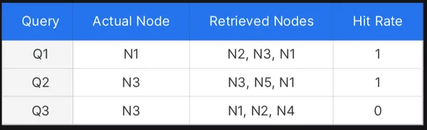
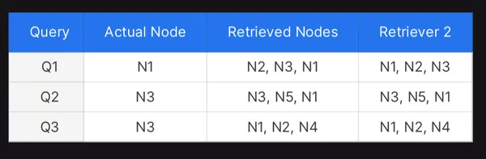
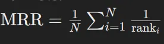

* https://www.analyticsvidhya.com/blog/2024/07/hit-rate-mrr-and-mmr-metrics/
* https://www.evidentlyai.com/ranking-metrics/precision-recall-at-k

## Hit Rate
**`Definition`**: Le hit rate, c’est le pourcentage de fois où on obtient le bon chunk parmi toutes les chunks récupérés.

> Pb with Hit Rate: Cela ne prend pas en compte la position du chunk pertinent parmi ceux récupérés. Dans l'exemple suivant on a 2 retrievers qui ont le même hit rate et pourtant le retriever 2 classe mieux les documents pertinents  (à la première position) et clairement ce retriever serait plus preferable: C'est là que le MRR (Mean Reciprocal Rank) est considéré

## MRR
**`Definition`**: Le MRR, indique à quelle position moyenne se trouve la première bonne réponse.

> **`Interprétation`** :
* MRR proche de 1: le bon résultat est souvent en tête.
* MRR proche de 0: le bon résultat est rarement trouvé ou très bas dans la liste.

